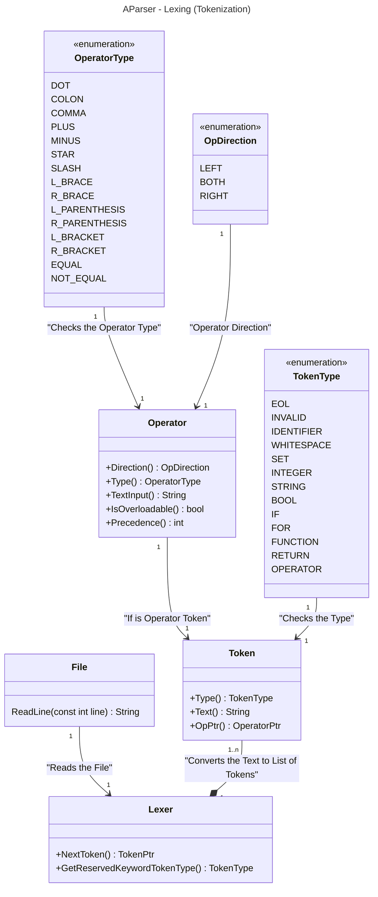

# Project Structure in UML Diagram
## Lexer Structure

### Operator Precedence for Arithmetic Operation
| Operator Type               | Precedence |
|-----------------------------|------------|
| EQUAL, NOT_EQUAL            | 1          |
| ASSIGN                      | 2          |
| L_BRACE, R_BRACE            | 3          |
| L_PARENTHESIS, R_PARENTHESIS| 4          |
| PLUS, MINUS                 | 5          |
| STAR, SLASH                 | 6          |
| Others                      | 7          |